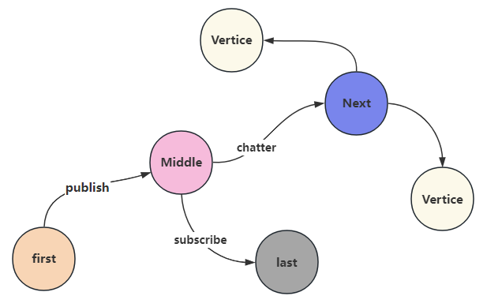
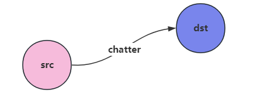

# Cmw的拓扑机制设计

**拓扑结构**是指网络中各个站点相互连接的形式，在cmw中的拓扑简单来说就是当一个新的节点加入时，其他节点能够知道你加入了，维护这样一个拓扑图。当新的节点加入时，他可能是一个发布者也可能是一个订阅者，这个节点需要在真正发布或者订阅数据时先广播自身的信息，这样其他的节点才能知道新加入的这个节点的信息从而建立连接。

## 1.拓扑图中的角色

整个拓扑图中所有的角色都是通过`RoleAttributes`这个结构体来描述的，这个类继承了`Serializable`是支持序列化的

```c++
struct RoleAttributes : public Serializable
{
    std::string host_name;       //主机名
    std::string host_ip;         //主机IP
    int32_t process_id;          //进程ID

    std::string channel_name;    // channel name
    uint64_t channel_id;         // hash value of channel_name

    QosProfile qos_profile;      //Qos配置策略
    uint64_t id;

    std::string node_name;       // node name
    uint64_t node_id;            // hash value of node_name
    
    std::string message_type;    // 消息类型
  SERIALIZE(host_name,host_ip,process_id,channel_name,qos_profile,id,node_name,node_id,message_type)
};
```

在`cmw`中有多种角色：`Node`，`Writer`，`Reader`，`PARTICIPANT`，其中`Server`和`Client`的模式还未实现，

```c++
//通信平面中角色的类型
enum RoleType {
  ROLE_NODE = 1,        // Node
  ROLE_WRITER = 2,      // Publisher
  ROLE_READER = 3,      // Subscriber
  ROLE_SERVER = 4,      // 
  ROLE_CLIENT = 5,
  ROLE_PARTICIPANT = 6,
};
```


在拓扑机制中`Reader`就对应`RTPSReader`，`Writer`就对应`RTPSReader`。在最外层则封装成了`Subsriber`和`Publihser`。

首先在`discovery/role`目录下定义了一个`RoleBase`的类来提供一些操作`Role`的接口，`RoleWriter`和`RoleReader`以及`RoleNode`都是`RoleBase`类型的。

## 2. 拓扑图的底层数据结构

### 2.1 `SingleValueWarehouse`

`SingleValueWarehouse`内部维护了一个`RoleMap`

```c++
using RoleMap = std::unordered_map<uint64_t, RolePtr>;
using RolePtr = std::shared_ptr<RoleBase>;
```

由于`RoleMap`使用的是`unordered_map`，因此键值是不可重复的，是唯一的。向`SingleValueWarehouse`中添加一个`Role`：

```c++
  bool Add(uint64_t key, const RolePtr& role,
           bool ignore_if_exist = true)
```

通过一个唯一的`key`去寻找`Role`

### 2.2 `MultiValueWarehouse`

`MultiValueWarehouse`内部也同样维护了一个`RoleMap`

```c++
using RoleMap = std::unordered_multimap<uint64_t, RolePtr>;
```

由于此时采用的是`unordered_multimap`，是允许键值重复的

### 2.3 `Graph`

首先设计了一个顶点类：`Vertice`，代表图中的一个顶点

 

这个类内部就是维护了一个`std::string value_`用这个`value_`值带代表顶点。

```c++
const std::string& Vertice::GetKey() const { return value_; }
const std::string& value() const { return value_; }
```

对于顶点类来说，它返回的`key`和`value`值都是它内部维护的这个`value_`的值

然后设计了一个边类：`Edge`，代表图中的一条边，，每条边都是有一个出发顶点和目标顶点


但是这个边类有个很奇怪的设计就是：

```c++
const std::string& value() const { return value_; }
std::string Edge::GetKey() const { return value_ + "_" + dst_.GetKey(); }
```

对于一条边来说他的`value`就是`value_`，而返回的`key`是 

然后一张图就是由很多个顶点和边共同组成的：

`Graph`

首先定义了一个顶点的邻接表：

```c++
using VerticeSet = std::unordered_map<std::string, Vertice>;
```



对于`Middle`这个顶点来说，它可能和很多顶点连接在一起，因此使用`VerticeSet`来描述一个顶点与周围顶点的相邻关系，以顶点的`value_`作为`unordered_map`的`key`，

然后在一整张图中每个顶点都有自己的邻接表，因此定义了一个集合用来描述图中所有的邻接表，且这个邻接表是**有向的，只会保存从自身出发指向一个顶点的关系，这也是上面说到为什么那个奇怪的设计，是为了比如对于`middle`这个顶点来说，他的邻接表只会保存` list_["middle"] ["middle_chatter"] = next`  , ` list_["middle"] ["middle_subscribe"] = last`而不会保存从`first`通过`publish`到来那个通道，这个通道交由`first`保存; **

```c++
using AdjacencyList = std::unordered_map<std::string,VerticeSet>;
```

然后定义了一个`EdgeInfo`的用来描述所有边在图中的位置：`EdgeInfo`的`key`就是边的`value_`

```c++
    struct RelatedVertices {
        RelatedVertices() {}
        VerticeSet src;
        VerticeSet dst;
    };
    using EdgeInfo = std::unordered_map<std::string , RelatedVertices>;
```

一条边由两个相邻顶点，因此一条边会包含两个邻接表，比如对于`chatter`这条边来说，他需要知道`Middle`顶点和`Next`顶点的邻接关系才能具体知道这条边在图中的位置。将图中所有边的信息组合在一起就构成了`EdgeInfo`，`EdgeInfo`的`key`就是边的`value_`


有了上面的这些定义，想要描述一张图就和很明显了，至于要一个`EdgeInfo`和一个`AdjacencyList`，即：

```c++
    EdgeInfo edges_;
    AdjacencyList list_;
```

来看一下具体操作图的函数：

向图中插入一条边

```c++
void Graph::Insert(const Edge& e) {
   //判断此边是否为空
  if (!e.IsValid()) {
    return;
  }
  WriteLockGuard<AtomicRWLock> lock(rw_lock_);
  //拿到插入边的value值
  auto& e_v = e.value();
  if (edges_.find(e_v) == edges_.end()) {
    //如果图中没有这条边，则为此边新建一个RelatedVertices
    edges_[e_v] = RelatedVertices();
  }
  //如果此边的出发点不为空，则插入一条出边
  if (!e.src().IsDummy()) {
    InsertOutgoingEdge(e);
  }
   //如果此边的目标点不为空，则插入一条入边
  if (!e.dst().IsDummy()) {
    InsertIncomingEdge(e);
  }
}
```

ok，假设现在图中什么都没有，我有一条边，他的出发顶点和目标顶点都不为空，从`src`到`dst`



则首先`edges["chatter"] = RelatedVertices()`，然后会调用`InsertOutgoingEdge`函数，

```c++
//插入一条出边
void Graph::InsertOutgoingEdge(const Edge& e) {
  
  //拿到出边的value
  auto& e_v = e.value();
  //拿到出边的源顶点的邻接表
  auto& src_v_set = edges_[e_v].src;
  //拿到出边的源顶点
  auto& src_v = e.src();
  //拿到出边源顶点的key
  auto& v_k = src_v.GetKey();
   //如果源顶点的邻接表不是空的则返回
  if (src_v_set.find(v_k) != src_v_set.end()) {
    return;
  }
  //代表指向自己
  src_v_set[v_k] = src_v;

  auto& dst_v_set = edges_[e_v].dst;
  Edge insert_e;
  insert_e.set_src(src_v);
  insert_e.set_value(e.value());
  for (auto& item : dst_v_set) {
    insert_e.set_dst(item.second);
    InsertCompleteEdge(insert_e);
  }
}
```

- e_v = "chatter"    
- src_v_set = edges_["chatter"].src  // src 顶点的邻接表
- src_v = e.src         //   src 顶点
- v_k = "src"           //    src 顶点的 key 
- src_v_set[v_k] = src_v; ----->  edges_["chatter"] ["src"] = e.src      //给边`chatter`的源顶点的邻接表赋值
- dst_v_set = edges_["chatter"].dst;      //此时 edges_["chatter"].dst 是空的，所以不会进入for循环去执行`InsertCompleteEdge`函数

然后会调用`void InsertIncomingEdge(const Edge& *e*);`

```c++
//插入一条入边
void Graph::InsertIncomingEdge(const Edge& e){
    //拿到入边的value
    auto& e_v = e.value();
    //拿到入边的目标顶点的连接表
    auto& dst_v_set = edges_[e_v].dst;
    //拿到入边的目标顶点
    auto& dst_v = e.dst();
    //拿到入边的目标顶点的value
    auto& v_k = dst_v.GetKey();

    if(dst_v_set.find(v_k) != dst_v_set.end()){
        return;
    }
    //代表指向自己
    dst_v_set[v_k] = dst_v;

    //拿到入边的出发顶点
    auto& src_v_set = edges_[e_v].src;
    //插入一条完整的边
    Edge insert_e;
    insert_e.set_dst(dst_v);
    insert_e.set_value(e.value());
    for(auto& item : src_v_set){
        insert_e.set_src(item.second);
        InsertCompleteEdge(insert_e);
    }
}
```

- e_v = "chatter"    
- dst_v_set = edges_["chatter"].dst  // dst 顶点的邻接表
- dst_v =  e.dst   // dst 顶点
- v_k = "dst"           //    dst 顶点的 key 
- dst_v_set[v_k] = dst_v     -------> edges_["chatter"] ["dst"] = e.dst //给边`chatter`的目标顶点的邻接表赋值
- src_v_set = edges_[e_v].src;     //src顶点的邻接表，此时不为空，因此会进入下面的for循环去插入边

```c++
//插入一条完整的边
void Graph::InsertCompleteEdge(const Edge& e)
{
    //拿到插入边的出发顶点的value
    auto& src_v_k = e.src().GetKey();
    //如果没有找到此顶点的邻接表，则新建一个新的邻接表
    if(list_.find(src_v_k) == list_.end()){
        list_[src_v_k] = VerticeSet();
    }

    //拿到插入边的终点的value
    auto& dst_v_k = e.dst().GetKey();
    //如果没有找到此顶点的邻接表，则新建一个新的邻接表
    if(list_.find(dst_v_k) == list_.end()){
        list_[dst_v_k] = VerticeSet();
    }

    //
    list_[src_v_k][e.GetKey()] = e.dst();
}
```

- src_v_k = "src"
- list_["src"] = VerticeSet()
- dst_v_k = "dst"
- list_["dst"] = VerticeSet()
- list_["src"] ["chatter_dst"] = e.dst  //这里很奇怪，

完成了上面的步骤后

 edges_["chatter"] ["dst"] = e.dst

 edges_["chatter"] ["src"] = e.src 

 list_["src"] ["chatter_dst"] = e.dst 

list_["dst"] = VerticeSet()

假设我现在又插入一条边：


edges["talker"] ["est"] = est

edges["talker"] ["dst"] = dst

list_["est"] ["talker_dst"] = dst 

list_["dst"] = VerticeSet()

插入的逻辑就如上分析